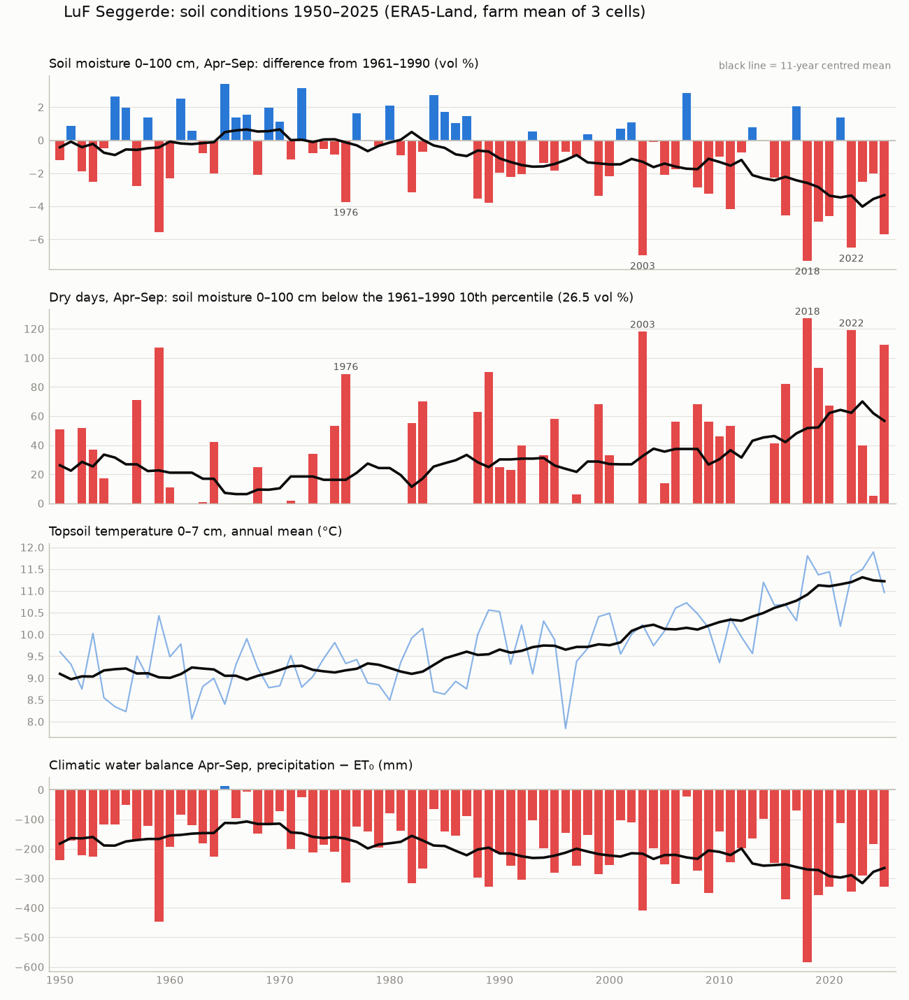
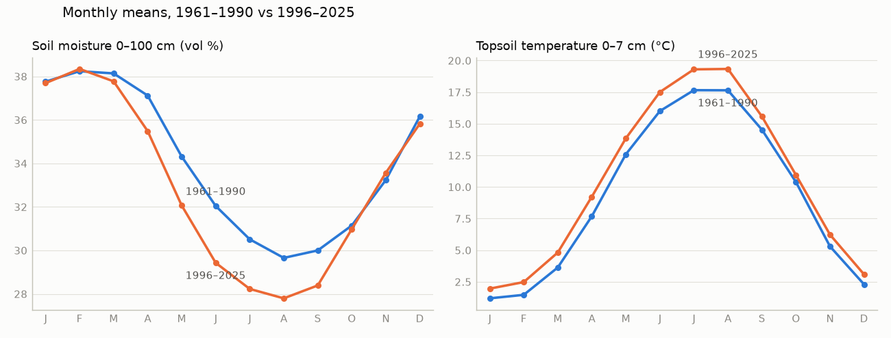

# How soil conditions on the farm have changed, 1950–2026 (ERA5-Land)

This answers the question "how has the soil changed over the years" as far as our data allows. **It covers soil *conditions*, not soil *properties*:**
- **Covered:** how wet and how warm the soil has been, from a reanalysis model driven by observed weather.
- **Not covered:** changes in texture, carbon or pH. None of our sources measures those more than once; see "What this does not show".

Pulled 2026-10-03, daily, 1950-01-01 → 2026-09-26.

## Files

| File | Content |
|---|---|
| `fetch.py` | Downloads the daily history from Open-Meteo. `uv run fetch.py`. Each request is cached in `raw/`, so a run stopped by the rate limit continues where it left off. |
| `analyze.py` | Builds everything below from `daily.csv`. `uv run analyze.py` |
| `cells.csv` | The ERA5-Land cells covering the farm: the field used as request point, the fields and area in each cell |
| `daily.csv` | One row per cell and day: soil moisture 0–7, 7–28, 28–100, 100–255 and 0–100 cm (m³/m³); soil temperature 0–7 and 28–100 cm (°C); precipitation, ET₀ (mm); 2 m air temperature (°C) |
| `annual.csv` / `annual_by_cell.csv` | Yearly indicators for the farm (area-weighted mean of the cells) and per cell |
| `trends.csv` | Per indicator: Theil–Sen slope per decade with 95 % range, OLS slope, Mann–Kendall τ and p, means for 1961–1990, 1996–2025 and 2016–2025 |
| `decades.csv`, `monthly_climate.csv` | Decade means; monthly means for 1961–1990 vs 1996–2025 |
| `ndvi_vs_soil.csv` | 2019–2026: farm median peak NDVI (from `../sentinel2/`) next to that season's soil moisture |
| `plot_annual.png`, `plot_monthly.png`, `summary.json` | Figures, and every number quoted here |

**Sources:**
- Soil moisture and temperature come from `models=era5_land`, as daily means (the `_mean` daily variables).
- Precipitation, ET₀ and air temperature come from `models=era5_seamless`, because `era5_land` returns null precipitation in the daily API.

Each cell was requested at the representative point of its largest field. Growing season = April–September. Baseline = 1961–1990. Trends use the complete years 1950–2025.

**Coverage: 3 of the 4 cells**, which hold 86 of the 87 fields (858 of 884 ha). The 4th cell (`52.3_11.0`, only the field `Langes Feld`, 25.7 ha) is incomplete because the free API's daily limit was reached; 11 of its 16 requests are still missing. Run `uv run fetch.py && uv run analyze.py` on another day to add it. Its neighbours behave almost the same (see "The cells agree"), so the results won't move noticeably.

## What changed

| Indicator | 1961–1990 | 1996–2025 | 2016–2025 | Trend 1950–2025 | Significant? (Mann–Kendall) |
|---|---|---|---|---|---|
| Soil moisture 0–100 cm, Apr–Sep mean (vol %) | 32.3 | 30.2 | **28.8** | −0.41 per decade (−0.69 to −0.15) | yes, p = 0.003 |
| Soil moisture 0–7 cm, Apr–Sep mean (vol %) | 32.8 | 30.5 | 28.7 | −0.40 per decade | yes, p = 0.004 |
| Soil moisture 100–255 cm, year mean (vol %) | 36.0 | 35.3 | 34.7 | −0.1 per decade | no, p = 0.27 |
| Dry days, Apr–Sep (0–100 cm below 26.5 vol %, the 1961–1990 10th percentile) | 18 | 40 | **64** | +4.7 days per decade (OLS) | yes, p = 0.04 |
| Topsoil temperature 0–7 cm, year mean (°C) | 9.2 | 10.4 | **11.2** | +0.30 °C per decade (+0.22 to +0.37) | yes, p < 0.001 |
| Soil temperature 28–100 cm, year mean (°C) | 9.2 | 10.3 | 11.1 | +0.29 °C per decade | yes, p < 0.001 |
| Days with frozen topsoil (daily mean 0–7 cm < 0 °C) | 31 | 22 | **11** | −2.6 days per decade | yes, p = 0.002 |
| Precipitation, year (mm) | 646 | 640 | 639 | none | no, p = 0.94 |
| Precipitation, Apr–Sep (mm) | 360 | 342 | 320 | −5 per decade | no, p = 0.11 |
| ET₀, year (mm) | 659 | 733 | **775** | +15 per decade | yes, p < 0.001 |
| Water balance P − ET₀, Apr–Sep (mm) | −158 | −240 | **−297** | −17 per decade | yes, p = 0.003 |

1. **The root zone is drier in summer.** Growing-season soil moisture in the top metre has dropped by 2 vol % since 1961–1990, and by 3.5 vol % in the last ten years.
   - Dry days have more than tripled: from 18 to 64 per season.
   - 4 of the 5 driest growing seasons since 1950 came after 2000: 2018, 2003, 2022 and 2025, with 1959 the exception.
   - Years in the driest fifth of the record, per decade: 1 (1950s), 0 (1960s), 1 (1970s), 3 (1980s), 1 (1990s), 3 (2000s), 4 (2010s), and already 3 in 2020–2025.
2. **The cause is evaporative demand, not less rain.** Annual precipitation hasn't changed (646 → 639 mm). ET₀ has risen by about 115 mm a year (659 → 775), and that is what turns the growing-season water balance more negative.
3. **The soil still refills every winter.** All of the drying is in April–September; January–March and November–December are within ±0.4 vol % of the baseline.
   - The largest change is in June (−2.6 vol %). Soil moisture now falls earlier in spring and stays low later into September (`plot_monthly.png`).
   - The deep layer (100–255 cm) has hardly changed.
4. **The soil is warmer and freezes less.** The topsoil is 1.2 °C warmer than in 1961–1990, and 2 °C warmer over the last decade. Every month has warmed, most of all July–August (+1.7 °C).
   - Days with frozen topsoil fell from 31 to 11 a year.
   - That means more months of biological activity (mineralisation of organic matter) and less frost to break up compacted soil.
5. **2026 is dry as well.** April to 26 September averaged 28.3 vol % (0–100 cm), against 32.4 % for the same window in 1961–1990. That makes it the 10th driest of 77 seasons.

### Link to crop performance (Sentinel-2, 2019–2026)

| Year | Farm median peak NDVI | Soil moisture anomaly Apr–Sep (vol %) | Dry days |
|---|---|---|---|
| 2019 | 0.855 | −4.9 | 93 |
| 2020 | 0.843 | −4.6 | 67 |
| 2021 | 0.862 | +1.4 | 0 |
| 2022 | 0.818 | −6.5 | 119 |
| 2023 | 0.854 | −2.5 | 40 |
| 2024 | 0.843 | −2.0 | 5 |
| 2025 | **0.804** | −5.7 | 109 |
| 2026 | 0.866 | −3.9 (to 26 Sep) | 79 |

The two lowest-NDVI seasons, 2025 and 2022, are also the two driest of these 8 years, and the wettest season (2021) is among the greenest. Over the 8 years the rank correlation is ρ = 0.59 (p = 0.13). That's consistent with drought limiting the crops, but 8 seasons can't prove it.

Peak NDVI also depends on the crop grown each year, which we don't know (see `../sentinel2/README.md`). With the farm's rotation records this could be tested per crop and per field.

### The cells agree

The three cells give nearly the same trends:
- soil moisture: −0.41 to −0.43 vol % per decade
- topsoil temperature: +0.29 to +0.30 °C per decade

The farm-level answer therefore doesn't depend on which cell a field falls in.

## What this does not show

- **Changes in the soil itself.** ERA5-Land runs on a fixed soil-texture map and fixed land cover, with no tillage, drainage, irrigation or crop data. The trends above are the **climate's effect on this soil**, not a change in carbon, structure or compaction.
  - No source we've pulled has repeated measurements of soil properties. The only real record would be the farm's own lab tests (pH, P, K, often humus), which German farms repeat about every 6 years under the fertiliser rules (DüV). We'd need to ask the farm for them.
- **Differences between fields.** One value per ~9 km cell. Sandy fields (BÜK200 unit 392611) will dry out faster than these numbers suggest, and wet Gley fields (392630) more slowly. See `../../overlap/README.md`.
- **Absolute water content.** ERA5's own soil parameters don't match SoilGrids, so use these numbers as change and anomaly, not as "x mm plant-available water".
- **Early decades are less certain.** Before about 1979, ERA5 assimilated far fewer observations, especially without satellite data. The changes are robust to that, though: most of the change is after 1990.

## Rate limits

The full pull is 64 requests (4 cells × 8 decades × 2 variable sets). Each request asks for 10 years of daily data, and Open-Meteo weights requests by length, so the pull used about a day's free quota (10,000 weighted calls). It also hit the per-minute limit several times.
- `fetch.py` waits 70 s after a per-minute 429 error.
- After a daily-limit error it stops downloading and builds `daily.csv` from the complete cells.
- Don't re-run it with `--force` unless you really need to.
