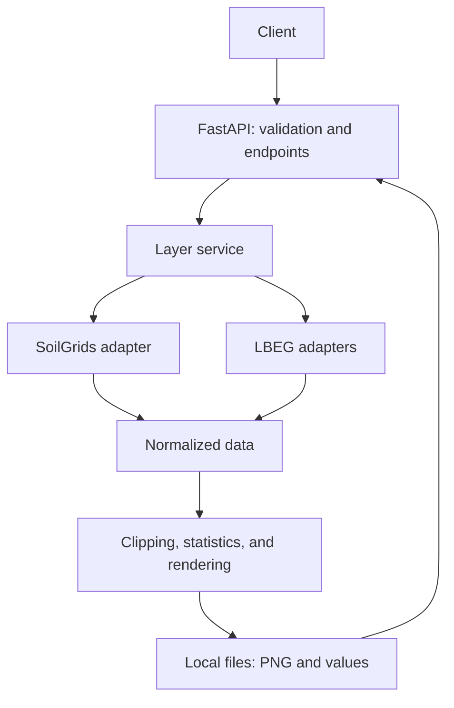

# Soil Aggregation REST API: Architecture and Implementation Milestones

Date: 2026-10-03

Status: Planning baseline. No API implementation has started as part of creating
this document. Implementation proceeds when requested by the user.

## Objective and scope

Build a single FastAPI application that accepts GeoJSON farm fields and returns
soil layers by field, parameter, and source. Start with one field and one real
layer, then expand to the backend MVP required by the
[project specification](project-raw-specs.md).

The backend MVP covers texture, pH, soil organic carbon, plant-available water
(nFK), and Bodenzahl, using SoilGrids and the necessary LBEG sources. Not every
source must supply every parameter. Missing or unsupported combinations must be
explicit rather than fabricated.

The map frontend and public deployment are outside this plan. Therefore,
completing the backend MVP does not complete the entire hackathon deliverable.

## Minimal architecture

All components are modules within one application:

| Component | Responsibility |
| --- | --- |
| API | Validate GeoJSON, parameters, and sources; return results and errors. |
| Layer service | Coordinate queries and retain successful results when a source fails. |
| Adapters | Retrieve data and translate it into a common representation with metadata. |
| Geospatial processing | Normalize, clip, calculate statistics, and generate PNGs. |
| Storage | Save images, values, and metadata; reuse results. |

Each adapter declares its capabilities and provides an operation to retrieve
data for an area. Provider-specific protocols and attribute names remain inside
the adapters.

Initial simplifications:

- One application instance; requests wait for completion within explicit timeouts.
- Local files for artifacts; no database, Redis, or job queue.
- PNG and JSON grids as initial outputs. Downloadable GeoTIFF is a later option;
  this does not prevent reading raster formats internally.
- A fixed target depth of 0–30 cm, with explicit exceptions where the source
  cannot represent it.
- A local demo using fields within verified LBEG coverage.
- Intensive raster processing runs outside the asynchronous event loop.

Introduce background jobs only if measured processing times make direct requests
insufficient. Set limits on fields, area, vertices, pixels, concurrency, and
provider calls before accepting larger workloads.

## Initial REST contract

| Endpoint | Purpose |
| --- | --- |
| `GET /health` | Check that the application is running. |
| `GET /soil/capabilities` | List supported parameters, sources, depths, and limitations. |
| `POST /soil/layers` | Generate layers for the submitted fields. |
| `GET /rasters/{artifact_id}.png` | Retrieve a rendered image. |
| `GET /rasters/{artifact_id}.json` | Retrieve grid values and georeferencing. |

The layer request uses `fields`, `parameters`, and `sources`, following the
specification's suggested structure. Expand `texture` into `clay`, `sand`, and
`silt` when numeric percentages are available. Identify categorical texture
classes separately.

Each result includes:

- Status per field, parameter, and source.
- Image and data URLs, unit, statistics, and legend.
- Bounds ordered as `[west, south, east, north]` in geographic coordinates.
- Grid CRS, dimensions, and spatial transform.
- Represented depth, source resolution, and output resolution.
- Source, retrieval date, available dataset version/date, and transformation method.

Missing grid values are `null`, never zero. Partial failures retain valid layers.
A total provider outage must not become an empty success response. Distinguish
unsupported parameters, missing coverage, missing data, and provider failures.

Finalize schemas, status codes, grid orientation, and numeric request limits
in unit 1A, before the first integration. Enforce initial limits and timeouts in
1B; extend workload budgets before enabling multiple fields in 2A. The endpoint
list is the design baseline.

## Source feasibility and expected coverage

The official SoilGrids access documentation reviewed for this plan reports a
temporary pause of its REST API and recommends alternatives, including WCS for
map subsets. The architecture must support raster access without depending on
REST point queries. This was a documentation review, not a successful live data
retrieval. Recheck service availability in unit 0A and each relevant 0B check.

LBEG publishes WMS services, but usable attributes and coverage must be verified
for each required layer. A rendered map alone does not establish access to
underlying numeric values.

| Parameter | Candidate source | Decision to verify |
| --- | --- | --- |
| Numeric texture | SoilGrids | Unit conversions and depth aggregation. |
| pH | SoilGrids | A documented method for representing 0–30 cm. |
| Soil organic carbon | SoilGrids | Unit and depth weighting. |
| nFK | Derived from SoilGrids; BK50 as additional data | Do not equate root-zone values with 0–30 cm values. |
| Bodenzahl | LBEG Bodenschätzung | Access to the actual value and geographic coverage. |

This matrix is a working hypothesis based on the requirements, not verified
availability. Units 0A and 0B must resolve access to values, formats, units,
depths, coverage, restrictions, and attribution requirements before the
corresponding integration. Do not infer values from
map colors or silently substitute fixtures if access fails.

Official references consulted:

- [SoilGrids access documentation](https://docs.isric.org/globaldata/soilgrids/SoilGrids_faqs_02.html)
- [LBEG official WMS services](https://www.lbeg.niedersachsen.de/kartenserver/web_map_services_wms/kartendienste-web-map-services-des-lbeg-91769.html)

## Implementation milestones

The former phases are milestones, not single implementation tasks. Their
bounded work units, dependencies, and evidence requirements are defined in
[Implementation units](implementation-units.md). All units are initially
planned; this reorganization records no completed implementation or live checks.

| Milestone | Required units | Acceptance gate |
| --- | --- | --- |
| M0: Initial data feasibility | 0A | One real source/parameter has reproducible spatial value access and sufficient metadata for the first integration. |
| M1: First end-to-end integration | 1A, 1B after M0 | One field and one real layer yield downloadable PNG and JSON, correct clipping, statistics, provenance, and enforced limits. This is a technical demonstration. |
| M2: Functional backend MVP | 2A–2F and their 0B checks, after M1 | Multiple fields and all five parameters work through SoilGrids and the necessary LBEG sources; capabilities, provenance, and partial failures are verified. Any missing required parameter keeps M2 incomplete. |
| M3: Reproducible demo and freshness | 3A–3C after M2 | Cache reuse, explicit refresh, and a clean-environment demo are verified; failures remain visible. |
| M4: Cross-source derived layers | 4A–4C after M2 | Compatible aggregation, source counts, spread, and separately identified provider uncertainty meet their documented data requirements and tests. |

0B is a repeatable feasibility gate for each expansion, not a requirement to
verify every source before M1. A blocked combination blocks its dependent unit,
not unrelated work. M2 still requires every necessary integration gate to pass.
M3 and M4 are independent after M2; cache integration for derived layers must be
checked when both are present.

Capabilities, provenance, and startup instructions begin in M1 and evolve with
each unit. Parameter-specific nFK derivation belongs to M2; cross-source
aggregation belongs to M4. Limits and timeouts are prerequisites for querying
providers, not additions deferred until the demo milestone.

### Former Phase 5: Evidence-driven extension backlog

Downloadable GeoTIFF, asynchronous jobs, remote storage, and additional sources
are candidates, not a scheduled milestone or a condition for completing M2–M4.
Before starting an authorized extension, define a separate bounded unit with a
demonstrated need, dependencies, exclusions, and measurable acceptance evidence.
Split extensions that contain multiple independently verifiable behaviors.

## Validation and delivery

Add meaningful checks during each unit: conversions, georeferencing, masks,
PNG/value correspondence, and external failure handling. Keep deterministic
fixture tests separate from real-provider integration checks.

Use the agent's [acceptance criteria](../skills/soil-api-engineer/references/acceptance.md)
for implementation reviews and delivery. Report what was tested and any remaining
limitations, rather than treating mocked results as proof of provider availability.

The recommended first delivery is M0 plus M1. M2 is the functional backend MVP;
M3 verifies a reproducible demo and freshness. Use the unit completion record in
[Implementation units](implementation-units.md#completion-record) to distinguish
local test results, real-provider evidence, blockers, and pending verification.

## Maintaining this plan

Use this document as shared architectural context, not as evidence that a phase
has been completed or as authorization to start implementation. Reconcile it with
the current user request and repository state. Record justified architectural
changes and verified provider findings here when relevant to authorized work;
do not silently broaden the scope or mark unverified milestones complete.
