# Soil Aggregation REST API: Architecture and Phased Implementation Plan

Date: 2026-10-03

Status: Planning baseline. No API implementation has started as part of creating
this document. Implementation proceeds when requested by the user.

## Objective and scope

Build a single FastAPI application that accepts GeoJSON farm fields and returns
soil layers by field, parameter, and source. Start with one field and one real
layer, then expand to the backend MVP required by the
[project specification](../project-raw-specs.md).

The backend MVP covers texture, pH, soil organic carbon, plant-available water
(nFK), and Bodenzahl, using SoilGrids and the necessary LBEG sources. Not every
source must supply every parameter. Missing or unsupported combinations must be
explicit rather than fabricated.

The map frontend and public deployment are outside this plan. Therefore,
completing the backend MVP does not complete the entire hackathon deliverable.

## Minimal architecture

```mermaid
flowchart TD
    A[Client] --> B[FastAPI: validation and endpoints]
    B --> C[Layer service]
    C --> D[SoilGrids adapter]
    C --> E[LBEG adapters]
    D --> F[Normalized data]
    E --> F
    F --> G[Clipping, statistics, and rendering]
    G --> H[Local files: PNG and values]
    H --> B
```

All components are modules within one application:

| Component | Responsibility |
| --- | --- |
| API | Validate GeoJSON, parameters, and sources; return results and errors. |
| Layer service | Coordinate queries and retain successful results when a source fails. |
| Adapters | Retrieve data and translate it into a common representation with metadata. |
| Geospatial processing | Normalize, clip, calculate statistics, and generate PNGs. |
| Storage | Save images, values, and metadata; reuse results. |

Each adapter declares its capabilities and provides an operation to retrieve
data for an area. Provider-specific protocols and attribute names remain inside
the adapters.

Initial simplifications:

- One application instance; requests wait for completion within explicit timeouts.
- Local files for artifacts; no database, Redis, or job queue.
- PNG and JSON grids as initial outputs. Downloadable GeoTIFF is a later option;
  this does not prevent reading raster formats internally.
- A fixed target depth of 0–30 cm, with explicit exceptions where the source
  cannot represent it.
- A local demo using fields within verified LBEG coverage.
- Intensive raster processing runs outside the asynchronous event loop.

Introduce background jobs only if measured processing times make direct requests
insufficient. Set limits on fields, area, vertices, pixels, concurrency, and
provider calls before accepting larger workloads.

## Initial REST contract

| Endpoint | Purpose |
| --- | --- |
| `GET /health` | Check that the application is running. |
| `GET /soil/capabilities` | List supported parameters, sources, depths, and limitations. |
| `POST /soil/layers` | Generate layers for the submitted fields. |
| `GET /rasters/{artifact_id}.png` | Retrieve a rendered image. |
| `GET /rasters/{artifact_id}.json` | Retrieve grid values and georeferencing. |

The layer request uses `fields`, `parameters`, and `sources`, following the
specification's suggested structure. Expand `texture` into `clay`, `sand`, and
`silt` when numeric percentages are available. Identify categorical texture
classes separately.

Each result includes:

- Status per field, parameter, and source.
- Image and data URLs, unit, statistics, and legend.
- Bounds ordered as `[west, south, east, north]` in geographic coordinates.
- Grid CRS, dimensions, and spatial transform.
- Represented depth, source resolution, and output resolution.
- Source, retrieval date, available dataset version/date, and transformation method.

Missing grid values are `null`, never zero. Partial failures retain valid layers.
A total provider outage must not become an empty success response. Distinguish
unsupported parameters, missing coverage, missing data, and provider failures.

Finalize schemas, status codes, grid orientation, and numeric request limits
during the first implementation phases; the endpoint list is the design baseline.

## Source feasibility and expected coverage

The official SoilGrids access documentation reviewed for this plan reports a
temporary pause of its REST API and recommends alternatives, including WCS for
map subsets. The architecture must support raster access without depending on
REST point queries. This was a documentation review, not a successful live data
retrieval. Recheck service availability in Phase 0.

LBEG publishes WMS services, but usable attributes and coverage must be verified
for each required layer. A rendered map alone does not establish access to
underlying numeric values.

| Parameter | Candidate source | Decision to verify |
| --- | --- | --- |
| Numeric texture | SoilGrids | Unit conversions and depth aggregation. |
| pH | SoilGrids | A documented method for representing 0–30 cm. |
| Soil organic carbon | SoilGrids | Unit and depth weighting. |
| nFK | Derived from SoilGrids; BK50 as additional data | Do not equate root-zone values with 0–30 cm values. |
| Bodenzahl | LBEG Bodenschätzung | Access to the actual value and geographic coverage. |

This matrix is a working hypothesis based on the requirements, not verified
availability. Phase 0 must resolve access to values, formats, units, depths,
coverage, restrictions, and attribution requirements. Do not infer values from
map colors or silently substitute fixtures if access fails.

Official references consulted:

- [SoilGrids access documentation](https://docs.isric.org/globaldata/soilgrids/SoilGrids_faqs_02.html)
- [LBEG official WMS services](https://www.lbeg.niedersachsen.de/kartenserver/web_map_services_wms/kartendienste-web-map-services-des-lbeg-91769.html)

## Implementation phases

### Phase 0: Data feasibility

Test a SoilGrids subset retrieval and LBEG queries for a reference field. Confirm
attributes, units, depth, coverage, access restrictions, and usable retrieval
methods. Record evidence and identify blockers.

Exit criterion: Real values and a viable access method exist for the required
sources. If a required source or parameter is inaccessible, document the gap and
its impact before committing to the corresponding integration.

### Phase 1: First end-to-end integration

Create FastAPI, input models, and one SoilGrids adapter. Process one field and
one straightforward parameter, such as clay. Produce a PNG, JSON grid, and
statistics from real data.

Exit criterion: One request produces a correctly located and clipped real layer,
including correct handling of geometry holes and `nodata`.

This is a technical demonstration, not the complete backend MVP.

### Phase 2: Backend MVP

Support multiple fields, expand parameter coverage, and integrate the necessary
LBEG sources. Implement capabilities, provenance, and partial failures.

Exit criterion: The five parameters are covered using the necessary sources,
and unavailable source/parameter combinations are documented. If a required
parameter remains unavailable, report the MVP as incomplete.

Parameter-specific calculations necessary for nFK belong here; cross-source
aggregation belongs in Phase 4.

### Phase 3: Reproducible demo

Add a disk cache, refresh through `refresh: true` on the layer request, workload
limits, timeouts, and startup documentation. Cache keys account for geometry,
parameters, source, depth, resolution, and processing method/version.

Exit criterion: The demo is repeatable, refresh queries the sources again and
invalidates affected results, and failures remain visible.

### Phase 4: Derived layers

Add aggregation across compatible sources, source counts per cell, spread, and
separately identified uncertainty. Document formulas and weighting. Combine only
values comparable in unit, depth, spatial support, and meaning.

Exit criterion: Formulas and insufficient-data behavior are documented and tested.
A single source does not yield zero spread as evidence of agreement. Provider
uncertainty remains distinct from disagreement between sources.

### Phase 5: Evidence-driven extensions

Evaluate downloadable GeoTIFF, asynchronous jobs, remote storage, and additional
sources only when needed.

Exit criterion: Each extension addresses a demonstrated need and remains within
the user's requested scope.

## Validation and delivery

Add meaningful checks during each phase: conversions, georeferencing, masks,
PNG/value correspondence, and external failure handling. Keep deterministic
fixture tests separate from real-provider integration checks.

Use the agent's [acceptance criteria](../skills/soil-api-engineer/references/acceptance.md)
for implementation reviews and delivery. Report what was tested and any remaining
limitations, rather than treating mocked results as proof of provider availability.

The recommended first milestone is Phases 0 and 1. The functional backend MVP is
reached in Phase 2; Phase 3 makes its demonstration reproducible.

## Maintaining this plan

Use this document as shared architectural context, not as evidence that a phase
has been completed or as authorization to start implementation. Reconcile it with
the current user request and repository state. Record justified architectural
changes and verified provider findings here when relevant to authorized work;
do not silently broaden the scope or mark unverified milestones complete.
